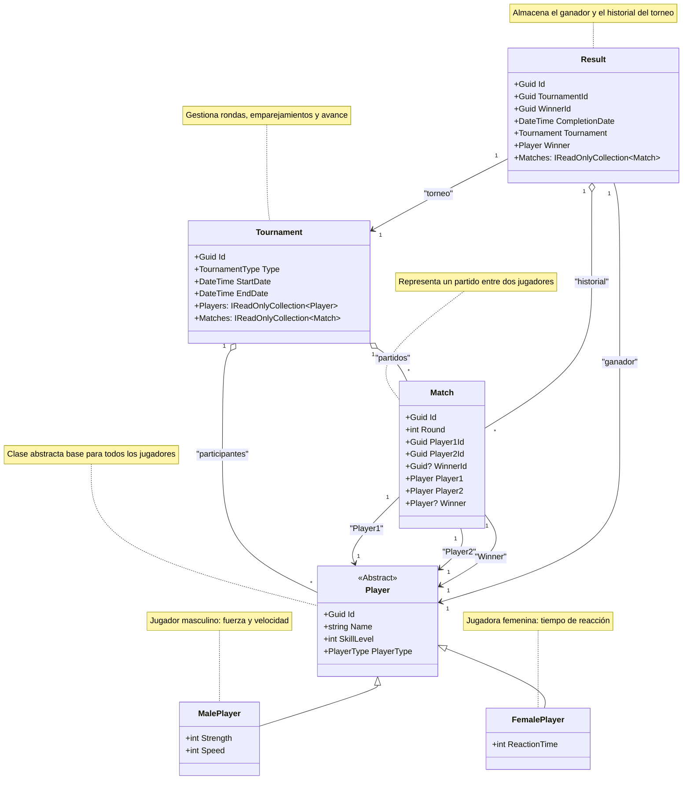
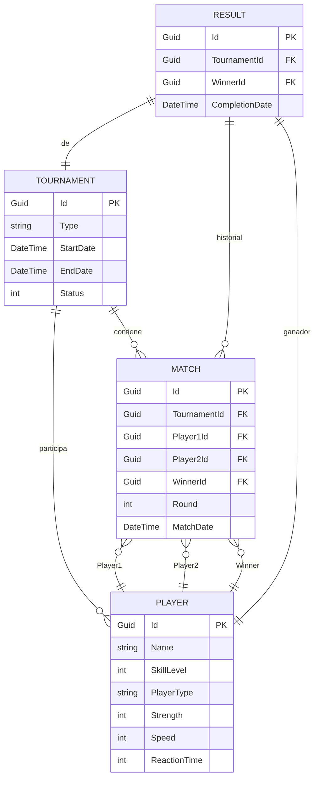

# Análisis y Diseño Conceptual del Sistema de Torneos de Tenis

_**Nota:** Además se agrega información sobre entorno, herramientas y misceláneos._

## Índice

1. Introducción
2. Requerimientos Funcionales y No Funcionales
3. Ciclo de Vida de la Solución
4. Modelado de Objetos del Dominio
5. Algoritmo de Simulación
6. Modelo de Datos Propuesto
7. Presentación sobre posibles alternativa al modelado de objetos
8. Validaciones y Reglas de Negocio
9. Patrones de Diseño Relevantes y Justificación
10. Endpoints Principales de la API
11. Nomenclatura y Buenas Prácticas
12. Definición y menciones sobre el entorno de desarrollo y misceláneos
13. Estructura del Proyecto siguiendo una separación lógica basada en Clean Architecture
14. Control de Versiones y Autores

---

## 1. Introducción

Este documento describe el análisis y diseño conceptual del sistema de torneos de tenis, abordando los requerimientos, el ciclo de vida, el modelado de objetos, el algoritmo de simulación, el modelo de datos, las validaciones, los patrones de diseño empleados y los endpoints principales, estableciendo las bases para la implementación técnica posterior.

## 2. Requerimientos Funcionales y No Funcionales

- Modelar un torneo de tenis por eliminación directa.
- Cantidad de jugadores: potencia de 2.
- Tipos de torneo: Masculino o Femenino.
- Jugadores con nombre y nivel de habilidad (0-100).
- Enfrentamientos definidos por habilidad y suerte; masculinos consideran fuerza y velocidad, femeninos tiempo de reacción.
- No existen empates.
- Simulación completa del torneo y determinación del ganador.
- Preferencia por arquitectura limpia y buenas prácticas OOP.

## 3. Ciclo de Vida de la Solución

1. Creación de jugadores.
2. Creación de torneos y asignación de jugadores.
3. Simulación del torneo (eliminación directa).
4. Consulta de resultados y partidos.
5. Gestión de nuevos torneos y jugadores.

## 4. Modelado de Objetos del Dominio

### 4.a. Diagrama de Objetos del Dominio

> **Nota:** Si no puedes visualizar el diagrama Mermaid, consulta la imagen:
> .png>)

_A continuación se presenta el diagrama UML de clases que ilustra las entidades principales y sus relaciones en el dominio del sistema de torneos de tenis._

- **Jugador (Player):** Clase abstracta, con subclases `MalePlayer` y `FemalePlayer`.
- **Partido (Match):** Enfrentamiento entre dos jugadores, con referencia a ronda y ganador.
- **Torneo (Tournament):** Contiene jugadores, partidos, fechas y estado.
- **Resultado (Result):** Almacena el ganador y el historial de partidos.

## 5. Algoritmo de Simulación

- Cálculo de puntaje total por jugador:
  - Masculino: `(SkillLevel * 0.5) + (Strength * 0.2) + (Speed * 0.2) + (Suerte * 0.1)`
  - Femenino: `(SkillLevel * 0.7) + (ReactionTime * 0.2) + (Suerte * 0.1)`
- Eliminación directa hasta un único ganador.

## 6. Modelo de Datos Propuesto

- Tablas: Players, Tournaments, TournamentPlayers, Matches, Results.
- Uso de claves primarias y foráneas, restricciones de integridad y validaciones de rango.

### 6.a. Diagrama Entidad-Relación (Modelo de Datos)

> **Nota:** Si no puedes visualizar el diagrama Mermaid, consulta la imagen:
>  (v.01).png>)

_El diagrama refleja el modelo que se espera implementar, incluyendo las entidades principales, sus atributos y las relaciones (uno a muchos, muchos a muchos y uno a uno) entre ellas. Estará alineada con la implementación y las migraciones de base de datos a realizar en la solución._

## 7. Presentación sobre posibles alternativa al modelado de objetos

| Aspecto                  | Modelo a desarrollar                                               | Modelo alternativo                                                                | Comentario                                                                                                                              |
| ------------------------ | ------------------------------------------------------------------ | --------------------------------------------------------------------------------- | --------------------------------------------------------------------------------------------------------------------------------------- |
| **Jugador**              | Clase base con herencia (`JugadorMasculino`, `JugadorFemenino`)    | Igual, pero sugiero que sea abstracta (`JugadorBase`)                             | Ambas soluciones son válidas; la abstracción reforzaría la integridad del modelo.                                                       |
| **Atributos de Jugador** | Nombre, NivelHabilidad (+ Fuerza/Velocidad o TiempoReacción)       | Igual, pero sugiero encapsular cálculos con `IEstrategiaCalculoPuntuacion`        | Modelo a desarrollar, los cálculos pueden quedar en la clase jugador; modelo alternativo, se propone el patrón Strategy para modularlo. |
| **Partido**              | Se llama `Match`, guarda Jugador1, Jugador2, Ganador, Ronda, Fecha | Se llama `Enfrentamiento`, misma estructura pero delega cálculos a una estrategia | En ambos modelos funciona bien; en el alternativo separa lógica mediante Strategy para más flexibilidad.                                |
| **Torneo**               | `Tournament`, lista de jugadores y gestión de rondas               | `Torneo`, igual estructura pero con validaciones explícitas                       | En ambos modelos el torneo centraliza el flujo del juego, modelo alternativo enfatiza la validación de jugadores como potencia de 2.    |
| **Resultado**            | `Result`, contiene historial del torneo                            | `HistorialPartidos`, equivalente pero más granular                                | En el modelo alternativo, el historial puede desacoplarse de `Resultado` si se quiere un mayor registro detallado.                      |
| **Arquitectura**         | Clean Architecture, con capas bien definidas                       | Igual, pero se incluye Factory y Event Sourcing opcional                          | Ambos cumplen con buena separación de responsabilidades.                                                                                |

## **Conclusiones**

🔹 **Similitudes**: Ambas estructuras siguen principios de **arquitectura limpia**, separación por capas, validaciones adecuadas y el manejo de atributos específicos por tipo de torneo.  
🔹 **Diferencias clave**:

- El modelo a implementar mantiene los cálculos dentro de las clases (`Jugador`), mientras que el alternativo usa un **patrón Strategy** para definir cómo influyen habilidad, suerte y atributos adicionales.
- La persistencia en el modelo a implementar está enfocada en SQL Server con Entity Framework, mientras que en el alternativo se propondría **Event Sourcing** para hacer el historial más dinámico.
- En la API, se usaría **CQRS y MediatR**, lo que es excelente para desacoplar consultas de modificaciones. El modelo alternatico plantea añadir una **Factoría (`MatchSimulationStrategyFactory`)** para crear estrategias según el torneo.

## 8. Validaciones y Reglas de Negocio

- Rango de atributos (0-100).
- Consistencia de tipos de jugador y torneo.
- Potencia de 2 en cantidad de jugadores.
- Fechas coherentes (inicio/fin).
- Integridad referencial en relaciones.

## 9. Patrones de Diseño Relevantes y Justificación

- **Strategy:** Encapsula la lógica de simulación según tipo de torneo.
- **Factory:** Crea la estrategia adecuada según el tipo de torneo.
- **Repository:** Abstrae el acceso a datos.
- **CQRS:** Separa comandos y consultas.
- **Mediator:** Desacopla la comunicación entre componentes.

## 10. Endpoints Principales de la API

- `/api/players` (CRUD)
- `/api/tournaments` (CRUD)
- `/api/tournaments/{id}/simulate`
- `/api/tournaments/{id}/result`
- `/api/results` y filtros asociados
- `/api/matches` y consultas por torneo/jugador

## 11. Nomenclatura y Buenas Prácticas

- PascalCase para clases y propiedades.
- camelCase para variables y parámetros.
- Prefijo "I" para interfaces.
- Sufijos descriptivos (Repository, Service, Controller).
- Principios SOLID y uso de herramientas de análisis estático.

## 12. Definición y menciones sobre el entorno de desarrollo y misceláneos

- Se trabaja sobre un Windows 11 Pro (64bit)
- Se enmplea como EDI al Vsual Studio Code
  - Se utilizan los siguientes compontes relacionados al desarrollo
    - Markdown All in One
    - Mermaid Chart
    - Bruno
    - Rest Client
    - .NET Extension Pack
    - PowerShell
    - SQL Server (mssql)
    - Dev Containers
    - Docker
    - Docker DX
- Docker Desktop / Podman
  - Imagenes
    - SQL Server 2022
    - nginx slim
  - Docker Compose
    - La persistencia de datos y configuración en momento de ejecucioón de los contenedores se deposita en el host via la definicion de volumens.
- Power Shell Core 7.x
- SSL - OpenSSL / mkcert
- Scriptings de validación (ps1) sobre conf y servicios
- Otros...

## 13. Estructura del Proyecto siguiendo una separación lógica basada en Clean Architecture: _(Solución en .NET 9 C#)_

- TennisTournament.Domain → Modelado de entidades y lógica de negocio.
- TennisTournament.Application → Servicios y reglas de aplicación.
- TennisTournament.Infrastructure → Persistencia y adaptadores.
- TennisTournament.API → Exposición vía REST API.
- TennisTournament.Tests.Unit → Pruebas unitarias.
- TennisTournament.Tests.Integration → Pruebas de integración.

## 14. Control de Versiones y Autores

| Versión | Fecha      | Autor             | Cambios         |
| ------- | ---------- | ----------------- | --------------- |
| 1.0     | 11/05/2025 | Rey, Miguel Ángel | Versión inicial |

---
